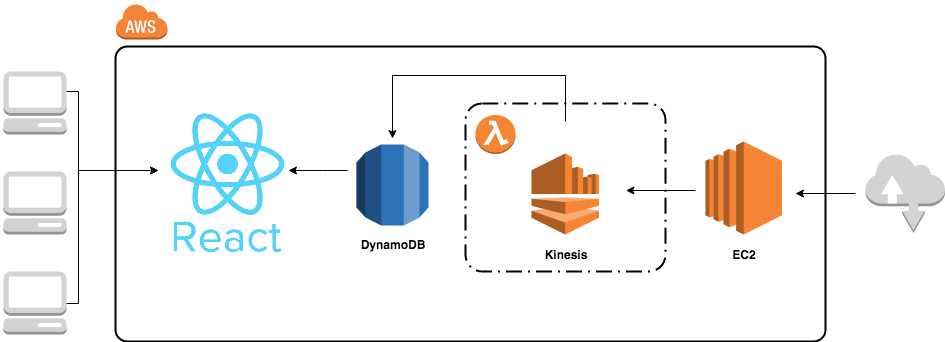

# Pixelfol.io

# About
Pixelfol.io is an investment research tool that creates a watchlist of stocks through mutual fund holdings. The tool empowers individual investors to make intelligent long-term investment decisions.  

# The Application
[pixelfol.io](www.pixelfol.io)

[Slides](https://docs.google.com/presentation/d/1CrwbVI4eQodna5-cx-RkSXVMfS_C2x5do9JFCapg8ho/edit#slide=id.g35f391192_00)

# The Data
The application tracks over 8,000 actively traded, US-listed securities. Data on all the currently listed securities (including mutual funds) are retrieved from NASDAQ OMX. And through XML crawling methods, mutual fund holdings are extracted from the Morningstar webpage for research purposes. IEX provides live-streaming transactional data.

# The Pipeline
The securities list updates daily - it is then compiled with the mutual fund holdings data and then stored into the persistence layer. Throughout the day, stock transactions are collected, processed, and stored via Websockets streaming. Each transaction record's ticker symbol is matched accordingly to the compiled fund holdings data - the data presented to the end user is updated and aggregated in near real time. The pipeline works predominantly with AWS resources.

Additionally, the application incorporates components of event-driven architecture - Streaming starts and shuts down when the market opens and closes, respectively, through daemonized processes on an AWS:EC2 instance. 

